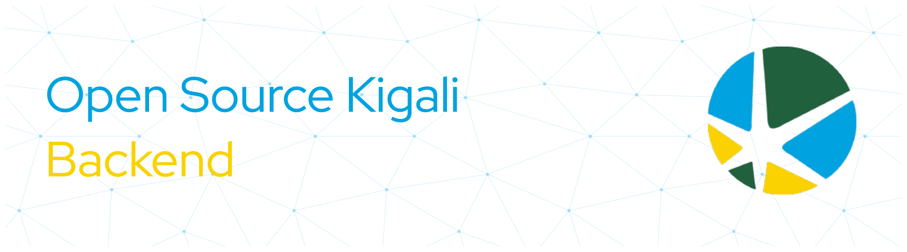

<!-- # Open Source Kigali | Backend -->



[](https://nodejs.org) [](https://expressjs.com) [](https://www.typescriptlang.org) [](https://www.postgresql.org) [](https://www.prisma.io) [](http://localhost:3000/api/docs)(https://www.swagger.com) [](https://www.docker.com) ●• [](https://opensource.org/licenses/MIT)  

Backend for the official website of [Open Source Kigali](https://github.com/Open-Source-Kigali). Built with Express, TypeScript, Prisma, and PostgreSQL.

<!--
## Tech stack

- **Runtime:** Node.js + Express
- **Language:** TypeScript (strict mode)
- **Database:** PostgreSQL via Prisma
- **Image storage:** Cloudinary
- **API docs:** OpenAPI served through Swagger UI -->
  
## Table of Contents

- Getting Started
- Environment Variables
- Database
- Project Structure
- Scripts
- API Documentation
- Contributing
- Contributors
- License

## Getting started

> **TL;DR** — clone the repo and get dependencies, setup your `.env` file, and you're up! Read more below for database setup, environment variables, project structure, and scripts. Here are quick commands to get started.

```bash
npm install
cp .env.example .env
docker compose up -d
npx prisma migrate dev
npm run dev
```

The server runs on `http://localhost:3000` by default.

<details>
<summary><b>⚙️ Environment variables</b></summary>
<br>

See `.env.example` for the full list.

| Variable                | Required             | Description                                                     |
| ----------------------- | -------------------- | --------------------------------------------------------------- |
| `PORT`                  | no                   | Server port (default `3000`)                                    |
| `NODE_ENV`              | no                   | `development` or `production`                                   |
| `DATABASE_URL`          | yes                  | PostgreSQL connection string                                    |
| `ADMIN_API_KEY`         | yes                  | Shared key for admin-only endpoints; sent as `x-api-key` header |
| `CORS_ORIGINS`          | yes                  | Comma-separated list of allowed origins                         |
| `CLOUDINARY_CLOUD_NAME` | for uploads          | Cloudinary cloud name                                           |
| `CLOUDINARY_API_KEY`    | for uploads          | Cloudinary API key                                              |
| `CLOUDINARY_API_SECRET` | for uploads          | Cloudinary API secret                                           |
| `GITHUB_TOKEN`          | for projects refresh | Fine-grained PAT with public repo read                          |

</details>

<details>
<summary><b>🗄️ Database</b></summary>
<br>

PostgreSQL runs locally via Docker. Make sure Docker is installed, then:

```bash
docker compose up -d         # start Postgres
npx prisma migrate dev       # apply migrations
npx prisma studio            # optional: browse the DB in a GUI
```

To stop the database: `docker compose down` (add `-v` to wipe the data).

</details>

<details>
<summary><b>🗂️ Project structure</b></summary>
<br>

```
src/
├── app.ts              Express app setup
├── server.ts           Entry point
├── config/             Environment, Prisma, and Cloudinary config
├── routes/             Route definitions
├── controllers/        Request handlers
├── services/           Business logic and database access
├── middlewares/        Auth, error handling, uploads
├── utils/              Response envelope, Cloudinary helpers
└── generated/          Prisma client output (gitignored)
prisma/
├── schema.prisma       Prisma schema
└── migrations/         Generated migration history
docs/
└── openapi.yaml        OpenAPI specification
```

</details>

<details>
<summary><b>📜 Scripts</b></summary>
<br>

- `npm run dev` — start the server in watch mode
- `npm run build` — compile TypeScript to `dist/`
- `npm start` — run the compiled build
- `npm test` — run the test suite
- `npm run lint` — lint the codebase
- `npm run format` — format with Prettier

</details>

## API Documentation

Admin-only endpoints require an `x-api-key` header matching `ADMIN_API_KEY`.

[](http://localhost:3000/api/docs)

The interactive Swagger UI is available at `http://localhost:3000/api/docs` once the server is running. The underlying spec lives at [`docs/openapi.yaml`](./docs/openapi.yaml).

### Public Endpoints

---

### GET /api/events

Returns all community events.

**Request**

```bash
curl -X GET http://localhost:3000/api/events \
  -H "accept: application/json"
```

**Response (200 OK)**

```json
{
  "success": true,
  "message": "Events retrieved successfully",
  "data": [
    {
      "id": "3fa85f64-5717-4562-b3fc-2c963f66afa6",
      "title": "Open Source Hack Night",
      "tagline": "Build together",
      "imageUrl": "https://example.com/event.png",
      "imagePublicId": "events/event-image",
      "description": "Monthly collaborative coding session.",
      "category": "Workshop",
      "mode": "in-person",
      "featured": true,
      "capacity": 100,
      "registered": 48,
      "date": "2026-08-15T09:00:00.000Z",
      "endDate": "2026-08-15T17:00:00.000Z",
      "timeLabel": "09:00 AM - 05:00 PM",
      "location": "Kigali",
      "speakers": ["Jane Doe"],
      "registerUrl": "https://example.com/register",
      "createdAt": "2026-07-09T10:01:42.376Z",
      "updatedAt": "2026-07-09T10:01:42.376Z"
    }
  ]
}
```

---

### GET /api/projects

Returns all open-source projects.

**Request**

```bash
curl -X GET http://localhost:3000/api/projects \
  -H "accept: application/json"
```

**Response (200 OK)**

```json
{
  "success": true,
  "message": "Projects retrieved successfully",
  "data": [
    {
      "id": "3fa85f64-5717-4562-b3fc-2c963f66afa6",
      "slug": "osk-backend",
      "repoOwner": "Open-Source-Kigali",
      "repoName": "osk-backend",
      "imageUrl": "https://example.com/project.png",
      "imagePublicId": "projects/backend",
      "tagline": "Official backend API",
      "category": "Backend",
      "status": "active",
      "featured": true,
      "maintainer": "Open Source Kigali",
      "langColor": "#3178C6",
      "ghDescription": "Backend powering the OSK website",
      "ghLanguage": "TypeScript",
      "ghTopics": [
        "express",
        "typescript",
        "prisma"
      ],
      "ghStars": 42,
      "ghForks": 15,
      "ghOpenIssues": 7,
      "ghContributors": 18,
      "ghPullRequests": 3,
      "ghPushedAt": "2026-07-09T10:27:49.663Z",
      "lastFetchedAt": "2026-07-09T10:27:49.663Z",
      "createdAt": "2026-07-09T10:27:49.663Z",
      "updatedAt": "2026-07-09T10:27:49.663Z"
    }
  ]
}
```

---

### GET /api/members

Returns all registered community members.

**Request**

```bash
curl -X GET http://localhost:3000/api/members \
  -H "accept: application/json"
```

**Response (200 OK)**

```json
{
  "success": true,
  "message": "Members retrieved successfully",
  "data": [
    {
      "id": "3fa85f64-5717-4562-b3fc-2c963f66afa6",
      "name": "John Doe",
      "email": "john@example.com",
      "githubUsername": "johndoe",
      "orgName": "Open Source Kigali",
      "joinReason": "Contribute to open source.",
      "codingLevel": "beginner",
      "createdAt": "2026-07-09T10:28:20.333Z",
      "updatedAt": "2026-07-09T10:28:20.333Z"
    }
  ]
}
```

---

### GET /api/partners

Returns all community partners.

**Request**

```bash
curl -X GET http://localhost:3000/api/partners \
  -H "accept: application/json"
```

**Response (200 OK)**

```json
{
  "success": true,
  "message": "Partners retrieved successfully",
  "data": [
    {
      "id": "3fa85f64-5717-4562-b3fc-2c963f66afa6",
      "name": "Tech Rwanda",
      "websiteUrl": "https://techrwanda.org",
      "logoUrl": "https://example.com/logo.png",
      "logoPublicId": "partners/logo",
      "description": "Supporting the open-source community.",
      "email": "info@techrwanda.org",
      "partnershipReason": "Community sponsorship",
      "createdAt": "2026-07-09T10:27:28.595Z",
      "updatedAt": "2026-07-09T10:27:28.595Z"
    }
  ]
}
```

---

### GET /api/reviews

Returns testimonials submitted by community members.

**Request**

```bash
curl -X GET http://localhost:3000/api/reviews \
  -H "accept: application/json"
```

**Response (200 OK)**

```json
{
  "success": true,
  "message": "Reviews retrieved successfully",
  "data": [
    {
      "id": "3fa85f64-5717-4562-b3fc-2c963f66afa6",
      "name": "Jane Doe",
      "profileUrl": "https://example.com/profile.jpg",
      "profilePublicId": "reviews/jane",
      "role": "Software Engineer",
      "message": "Open Source Kigali helped me grow as a developer.",
      "createdAt": "2026-07-09T10:04:13.004Z",
      "updatedAt": "2026-07-09T10:04:13.004Z"
    }
  ]
}
```

---

### Common Error Response

All endpoints may return the following response if an unexpected server error occurs.

```json
{
  "success": false,
  "message": "Internal server error",
  "data": null
}
```